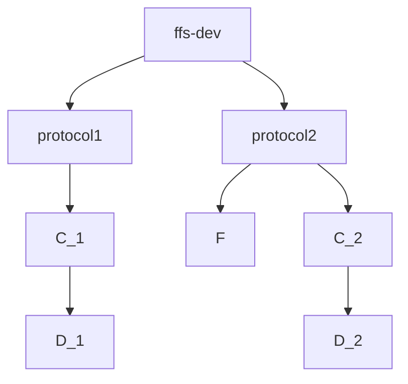
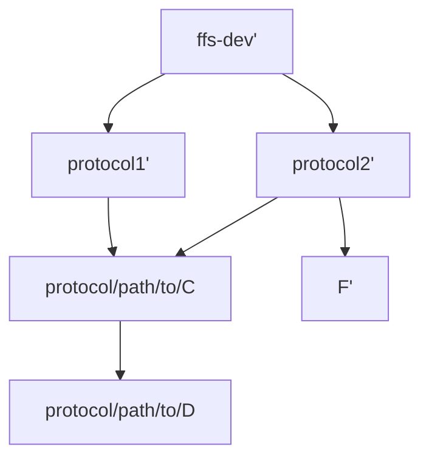

# `cli`

The `cli` directory contains the command line interface for FFS.

## Overview

The `cli` directory contains the command line interface for FFS. It is organized into the following subdirectories:

- [`ffs-client`](./ffs-client/README.md): the command line interface for FFS clients
- [`ffs-dev`](./ffs-dev/README.md): the command line interface for FFS developers
- [`ffs`](./ffs/README.md): the main FFS command line tool

## Usage

We recommend using [`ffs-dev`](sdk/cli/ffs-dev/README.md) as the best starting point for using this repo.

To build `ffs-dev` manually you can run the following command:

```bash
cargo build -p ffs-dev --release
```

The `ffs-dev` binary will then be available in `target/release/ffs-dev`. 

> [!NOTE]
> We use [`clap`](https://docs.rs/clap/latest/clap/) to build our CLIs, so you can always call `--help` to get a list of available commands and their usage.

> ![NOTE]
> If you are developing in the nix shell, `target/release/*` and `target/debug/*` will both be on the path and you can use the CLIs directly. 

The commands are composed as follows:

```
./target/release/ffs-dev 
    <command series> // hierarchical organized commands, see #Nested-Commands below for more details
  -- <any anvil data> // any anvil data to pass to anvil
```

## CLI Conventions

This section outlines the conventions used across FFS CLIs. Following these conventions ensures consistent user experience across all FFS CLIs and prevents namespace conflicts between protocols.

### `orfile::Orfile`

Many commands will use `orfile` to generate more ergonomic arg parsing. See the [`orfile`](https://github.com/movementlabsxyz/orfile) documentation for more detail. 

### Naming

- CLI commands use kebab-case: `post-commitment` not `postCommitment`
- Rust types use PascalCase: `PostCommitment`
- Modules use snake_case: `post_commitment`

### Module Organization

Modules are implemented as subdirectories in the `cli` directory of a given protocol, e.g. in `protocol/mcr/client/src/cli/`.

```
cli/
  mod.rs           # Main CLI structure
  post_commitment/ # Specific subcommand
      mod.rs       # Subcommand structure
```

This structure keeps related code together and makes it easy to add new commands without duplicating code.

We can view the CLI as a tree structure (from the point of view of the user). In contrast, for the developer it is organized such that code is not minimally duplicated. The following diagram shows the difference:

<div style="display: flex; gap: 2rem; align-items: flex-start;">

<div style="flex: 1; text-align: center;">
    


<p><strong>Figure 1:</strong> The flow when using the CLI.  D_1 and D_2 appear duplicated.</p>
</div>

<div style="flex: 1; text-align: center;">
    


<p><strong>Figure 2:</strong> The flow when developing the CLI.  D_1 and D_2 that appear duplicated from the CLI view, are the same in code.</p>
</div>

</div>

### Testing

- Each CLI command should have integration tests
- Use `clap`'s test utilities for argument parsing
- Test both success and error cases

### Documentation

- Include examples in complex commands
- Document any environment variables or config files needed
- Use doc comments (`///`) to explain command purpose

**Example**
In the `mod.rs` file, add a doc comment to the enum that describes the command.

```rust
pub enum HigherCommandLevel {
    /// Command one does ...
    LowerCommandOne(command::CommandOne),
    /// Command two does ...
    LowerCommandTwo(command::CommandTwo),
}

**Auto documentation**
We use `clap-markdown-ext` to automatically generate documentation for all CLI commands. This ensures documentation stays in sync with the actual implementation.

> [!NOTE]
> Always regenerate documentation when changing CLI commands to keep docs in sync with code.

Every CLI implements a `markdown` subcommand that generates documentation:

```bash
# Generate docs for ffs-dev CLI
./target/release/ffs-dev markdown generate
```

This is called by a pre-commit git hook in this repository. 

### Nested Commands (Command Hierarchy)

Commands are organized in a tree structure across different crates, where each level narrows down the scope:

```
ffs-dev                 # Root level  (in sdk/cli/ffs-dev/src/cli/mod.rs)
   └── mcr              # protocol type  (called in sdk/cli/ffs-dev/src/cli/mod.rs)
       └── protocol     # protocol command  (called in sdk/cli/ffs-dev/src/cli/mcr/mod.rs)
           └── client   # protocol client command  (called in protocol/mcr/cli/protocol/src/cli/mod.rs)
               └── post-commitment # command level  (called in protocol/mcr/cli/client/src/cli/mod.rs)
```

This tree structure is implemented through nested enums in different crates. Each level in the tree is represented by its own enum:

```rust
// Root level (called in sdk/cli/ffs-dev/src/cli/mod.rs)
#[derive(Parser)]
pub enum FfsDev {
    #[clap(subcommand)]
    Mcr(mcr::Mcr),  // branches into protocol type
}

// Protocol command (called in sdk/cli/ffs-dev/src/cli/mcr/mod.rs)
#[derive(Subcommand)]
pub enum Mcr {
    Protocol(McrProtocol),  // branches into protocol commands
}

// Protocol client command (called in protocol/mcr/cli/protocol/src/cli/mod.rs)
#[derive(Subcommand)]
pub enum McrProtocol {
    Client(McrProtocolClient),  // branches into client commands
}

// Command level (called in protocol/mcr/cli/client/src/cli/mod.rs)
#[derive(Subcommand)]
pub enum McrProtocolClientSubcommand {
    PostCommitment(post_commitment::PostCommitment),
    // ...
}
```

Each level in the tree corresponds to a nested enum in a different crate, allowing commands to be organized hierarchically while maintaining separation of concerns.

This structure ensures:

- each protocol gets its own namespace (e.g., `mcr` commands won't conflict with `pcp` commands)
- users can discover commands by moving from general to specific (e.g., protocol → component → action)
- each protocol can add its own specific commands without affecting others
